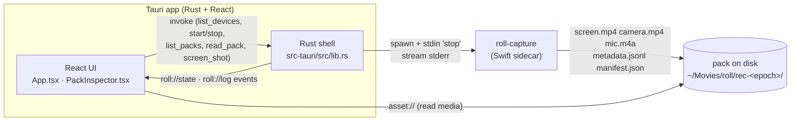
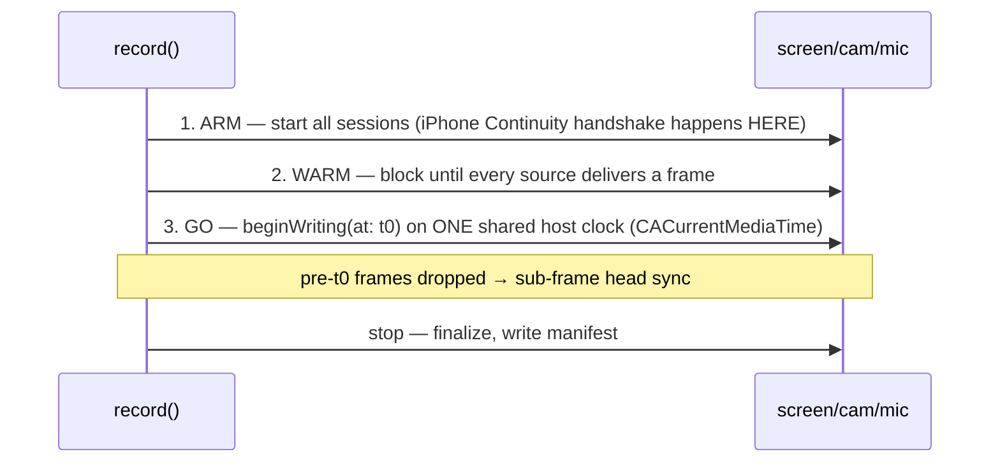

# roll — handoff for local dev

This doc hands the `feat/mac-capture` work from a remote Linux sandbox (where the
Swift engine could only be built via GitHub Actions and never *run*) to local
development on the Mac, where you can build, record, and read logs directly.

> **Why the switch:** the capture engine is native macOS (ScreenCaptureKit +
> AVFoundation + Accessibility). It can't be compiled or run on Linux, so every
> change round-tripped through CI and every behaviour had to be verified by Stu
> by hand. Local Claude Code gets `swift build`, real recordings, Console.app
> logs, and Instruments — the iPhone-camera bug below is a 10-minute fix locally
> and was un-debuggable remotely.

---

## What roll is

A native macOS recorder that captures **screen + camera + mic on one shared
clock**, plus rich **input/semantic telemetry** (clicks, drags, keystrokes,
scroll, cursor path, the Accessibility role/label of whatever was clicked, and a
continuous app/window-focus timeline). The output is a deterministic **"pack"**.

The thesis: `click × on-screen text (OCR) × transcript` = labelled *action
events*, which let an LLM (Opus) make better automated video-edit decisions —
"RAGing video." roll is the capture front-end; **edator** is the AI edit
pipeline; **crunch** (crunch.stumason.dev) does the CPU inference (OCR +
transcribe). roll's job is **capture + inspect**, not edit.

---

## Architecture



- The **Rust side owns no capture logic.** It spawns `roll-capture`, streams its
  stderr into `roll://state` / `roll://log` events, and stops it by writing a
  line to stdin (a clean `finish()` that flushes the mp4 moov atom — **never
  SIGKILL**, which truncates the file).
- Sources stay **separate files**, realigned via `manifest.json` firstPTS/offsets.

### Capture lifecycle (the sync trick)



Result: validated sub-frame sync (camera ~+5ms, mic ~+2ms vs screen).

---

## Repo layout

| Path | What |
|---|---|
| `capture-swift/` | Swift package, executable **`roll-capture`** (the engine). `Sources/roll-capture/main.swift` is the whole thing. `Info.plist` is embedded into the binary via a linker section (Continuity Camera opt-in). |
| `src-tauri/src/lib.rs` | Rust shell: spawn sidecar, commands, events, pack scanning, asset protocol. |
| `src-tauri/tauri.conf.json` | `macOSPrivateApi`, `assetProtocol` scope (`$VIDEO/roll/**`). |
| `src-tauri/Cargo.toml` | tauri features: `macos-private-api`, `protocol-asset`. |
| `src/App.tsx` | Main UI: previews, device dropdowns, record, library. |
| `src/components/PackInspector.tsx` | Synced playback + scrubbable telemetry timeline. |
| `src/api.ts` | The one IPC seam (real Tauri invoke vs browser mock). |
| `.github/workflows/mac-capture.yml` | Builds the Swift engine on macOS (the remote-compile loop — now optional). |
| `.github/workflows/app-mac.yml` | Builds the app: sidecar + `npm run build` + clippy `-D warnings` + cargo test. |
| `scripts/build-sidecar.sh` | `swift build -c release` → stage to `src-tauri/binaries`. |

---

## Build & run locally

```bash
# 1. engine (separate build — `tauri dev` does NOT rebuild it)
cd capture-swift && swift build -c release
.build/release/roll-capture --list          # smoke test: devices + (new) per-camera info

# 2. app
cd .. && npm install
npm run tauri dev
```

**Sidecar discovery** (`sidecar_path()` in lib.rs): sibling of the app exe →
`capture-swift/.build/release/roll-capture` (dev) → `PATH`. So a release build of
the engine is enough for `tauri dev` to find it.

Packs land in **`~/Movies/roll/rec-<epoch_ms>/`** (persistent, Finder-visible).

Permissions the sidecar needs (TCC, granted once per binary): Screen Recording,
Camera, Microphone, Accessibility.

---

## Current state (v0.0.14, CI green on `feat/mac-capture`)

**Working & validated on real packs:**
- Screen + camera + mic capture, sub-frame synced (one shared `t0`).
- Full-span `screen.mp4` even on a static screen (ScreenCaptureKit is
  change-driven; we anchor the first frame to t0, keepalive the last frame
  through static stretches, finalize at stop).
- Telemetry: `click` / `drag` / `cursor` / `key` / `scroll` / `app_focus` rows in
  `metadata.jsonl` (schema below).
- App: persistent **library** (scans `~/Movies/roll`), remembered device/fps
  selection, and a **pack inspector** (synced playback + scrubbable timeline with
  an app-focus track + colour-coded event ticks + live "now" readout).
- `--shot <i>` one-shot display screenshot (drives the screen-preview thumbnail).

**🔴 Open bug #1 — iPhone camera dropout (PRIORITY, needs local debugging):**
- In `rec-1782797736960` (v0.0.14, 37s take): `camera.mp4` is **5.0s of 150
  fully-black frames, then stops**, while `screen.mp4` and `mic.m4a` ran the full
  37s. Matches the live symptom: the green camera indicator flickers for <1s.
- The iPhone Continuity Camera connects, delivers black frames briefly, then the
  session stops feeding `CameraRecorder`. Screen/mic are unaffected.
- **First diagnostic (trivial locally):** add observers for
  `AVCaptureSessionRuntimeError`, `AVCaptureSessionWasInterrupted` /
  `InterruptionEnded`, and `AVCaptureDeviceWasDisconnected` in `CameraRecorder`,
  and log them. Watch Console.app during a take. Likely an interruption, a TCC
  camera-permission gap on the sidecar binary, or the Continuity device going to
  sleep. The black frames suggest the camera never actually produced an image
  even before it dropped — check the device's `isSuspended` / format selection.
- Note: built-in / USB (C920) cameras have *not* shown this — it's specific to
  the iPhone Continuity device. Reproduce with `--cam <iphone-index>` from
  `--list` and a long `--secs`.

**Other open items (lower priority):**
- Inspector media playback (`asset://`) only testable on the Mac — confirm screen
  /camera/mic load and stay synced from a real pack.
- No "saving…" progress detail during `finishWriting` on big files (cosmetic).

---

## Pack format

```
~/Movies/roll/rec-<epoch_ms>/
  screen.mp4        H.264, native display res, full-span
  camera.mp4        H.264 1280x720 (optional)
  mic.m4a           AAC (optional)
  metadata.jsonl    one JSON telemetry row per line (see below)
  manifest.json     { version, fps, t0, durationMs, display{id,x,y,w,h},
                      screen{file,firstPTS}, camera{...}, mic{...},
                      cameraSyncOffsetMs, micSyncOffsetMs, metadata }
```

### `metadata.jsonl` event types (all carry `t_ms` = ms since t0)
| type | fields |
|---|---|
| `click` | `x,y,button,mods`, + context `app,window,ax{role,label,bounds}` |
| `drag` | `from,to,t_ms,end_ms,button,mods`, + context |
| `cursor` | `x,y` (throttled 10Hz) |
| `key` | `key` (named for special keys), `mods` |
| `scroll` | `x,y,dx,dy` (accumulated, 10Hz) |
| `app_focus` | `app,window` (baseline at t0 + on every app switch) |

---

## CLI reference (`roll-capture`)

```
--list                                   devices (cameras now show
                                         type/continuity/deskCompanion/active/fmts)
--shot <i> [--width 480]                 one base64 PNG of a display on stdout
--screen <i> [--cam <i>] [--mic <i>] --out <dir> [--fps 30] [--secs N] [--width W --height H]
stop: --secs deadline, SIGINT, or a line / EOF on stdin
```

---

## Hard-won gotchas (don't re-learn these)

- **iPhone "desk view" framing = Center Stage.** The iPhone main Continuity
  camera is *ultra-wide*; Center Stage crops it to a framed face. Forcing Center
  Stage off (an earlier mistake) gives the raw ultra-wide field that looks like a
  desk view. v0.0.14 respects the user's Control Center toggle
  (`centerStageControlMode = .user`). Desk View proper is a *separate*
  `.deskViewCamera` device (1920×1440 only) — we never use it.
- **`AVCaptureDeviceTypeExternal` deprecation warning** from WebKit's getUserMedia
  (the in-app preview) is benign and unsuppressable — it does its own enumeration
  and ignores the app Info.plist. Don't chase it.
- The **sidecar needs its own embedded Info.plist** (`NSCameraUseContinuityCameraDeviceType`)
  to use the modern Continuity Camera path — done via a linker `-sectcreate`
  section in `Package.swift` (macOS reads `__TEXT,__info_plist` for bare CLI
  binaries). Without it you get the deprecated `.external` path and no Control
  Center camera controls.
- "No ding-ding handshake" is usually just the **iPhone not being awake**, not a bug.
- **`npm run tauri dev` does NOT rebuild the Swift sidecar** — build it separately.
- Stop the sidecar with a **stdin line / EOF**, never SIGKILL (truncates the mp4).

---

## Next steps (after the camera bug)

1. **Fix the iPhone camera dropout** (open bug #1) — now trivial with local logs.
2. **Crunch integration** — send screen frames to `/ocr` and mic to `/transcribe`,
   then paint two more layers (words-on-screen, words-spoken) onto the **same
   inspector timeline**. This completes the click × OCR × transcript picture in
   one view. (crunch `/ocr` had 500s on full-res frames — downscale first; see the
   crunch issues #11–17 on StuMason/crunch.)
3. Bundle a distributable `.app` (`tauri build`).
4. The thesis test: feed a real pack to edator/Opus and measure whether the rich
   telemetry actually improves edit decisions.

---

## Where things live off-repo

- Engine built remotely via GitHub Actions `mac-capture.yml` (now optional — build
  locally).
- Test packs were shuttled via Cloudflare R2 `r2:shuttle` between Stu's Mac and the
  sandbox. Local dev makes this unnecessary.
