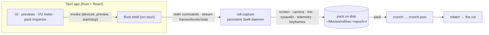

# roll

**Record once. Hand the agent a queryable pack.**

[](https://github.com/StuMason/roll/actions/workflows/app-mac.yml)
[](LICENSE)


`roll` is a native macOS recorder that captures **screen + camera + mic + system
audio on one shared clock**, alongside rich **input & semantic telemetry** —
every click, drag, keystroke, scroll, the typed text, the clipboard, the app/window
focus timeline, and the accessibility role/label of whatever you clicked. A take
isn't a video file, it's a deterministic **pack**: raw source an editing agent can
*query* instead of *watch*.

It's the capture front-end for **[edator](https://github.com/StuMason/edator)**:
`roll` makes the recording, [crunch](https://github.com/StuMason/crunch) turns it
into a joined index, edator makes the cut.

## Why

Every screen recorder throws away the most useful thing in the room: **what you
actually did.** The cursor path, the click on the *Deploy* button, the search you
typed, the window you switched to — all discarded the moment it renders to pixels.
An editing agent then has to *infer* those events back out of the video, expensively
and unreliably.

`roll` keeps them. The click at `t=63.2s` can be joined to the on-screen text under
the cursor **and** the words being spoken at that instant. That join —
`click × OCR × transcript` — is the raw material no recorder currently hands to an
agent. Get the capture right once (it's Rubbish-In-Rubbish-Out) and everything
downstream gets easier.

## What roll captures

| Source | Detail |
|---|---|
| **screen.mp4** | ScreenCaptureKit, native resolution, **constant frame rate**, monotonic PTS — frame-accurate cutting |
| **camera.mp4** | AVFoundation, incl. iPhone Continuity Camera; single persistent session (live preview *through* recording, no dropout) |
| **mic.m4a** | AAC, separate track |
| **sysaudio.m4a** | system/app audio on its own track (mic stays clean) |
| **metadata.jsonl** | `click` · `drag` · `cursor` · `key` · `scroll` · `app_focus` · `text` (typed) · `clipboard` — every row on the shared `t_ms` clock, coordinates in `screen.mp4` pixel space |
| **keyframes/** | pristine full-res PNGs snapshotted on click / app-switch (clean OCR, no re-decode) |
| **manifest.json** | the index: clock origin, fps, per-source sync offsets, display geometry |

Typed text and clipboard are **never** captured while macOS secure input is active
(password fields). The contract is enforced by
[`schemas/pack.schema.json`](schemas/pack.schema.json).

## Architecture

The Rust/Tauri app owns no capture logic — it drives a persistent native Swift
sidecar (`roll-capture`) that owns the camera the whole time (the OBS model: one
session feeds both the live preview and the recording).



The hard boundary is the **pack**: everything upstream is capture, everything
downstream is an agent querying facts. Get the boundary right and each half evolves
independently.

## Build & run

Requires macOS 13+, Xcode toolchain, Node, and Rust.

```bash
# 1. build the native capture engine (separate from the app build)
cd capture-swift && swift build -c release
.build/release/roll-capture --list        # smoke test: displays / cameras / mics

# 2. run the app (finds the sidecar in capture-swift/.build/release)
cd .. && npm install
npm run tauri dev
```

Packs land in **`~/Movies/roll/rec-<epoch_ms>/`**. On first run macOS will prompt
for **Screen Recording, Camera, Microphone, and Accessibility** — all four are
needed for full capture.

```bash
npm run build                                   # frontend
cargo test  --manifest-path src-tauri/Cargo.toml
cargo clippy --manifest-path src-tauri/Cargo.toml -- -D warnings
```

## Status

The native capture engine is **built and working**: synced multi-source capture,
constant-frame-rate screen, single-session camera, the full telemetry stream, a
live camera preview + mic VU meter, and an in-app **pack inspector** (synced
playback + scrubbable timeline). Downstream, [crunch](https://github.com/StuMason/crunch)
processes a pack into a joined `crunch.json` and [edator](https://github.com/StuMason/edator)
turns that into an edit. A signed, notarised, auto-updating `.app` is next.

## License

MIT © [Stuart Mason](https://github.com/StuMason)
