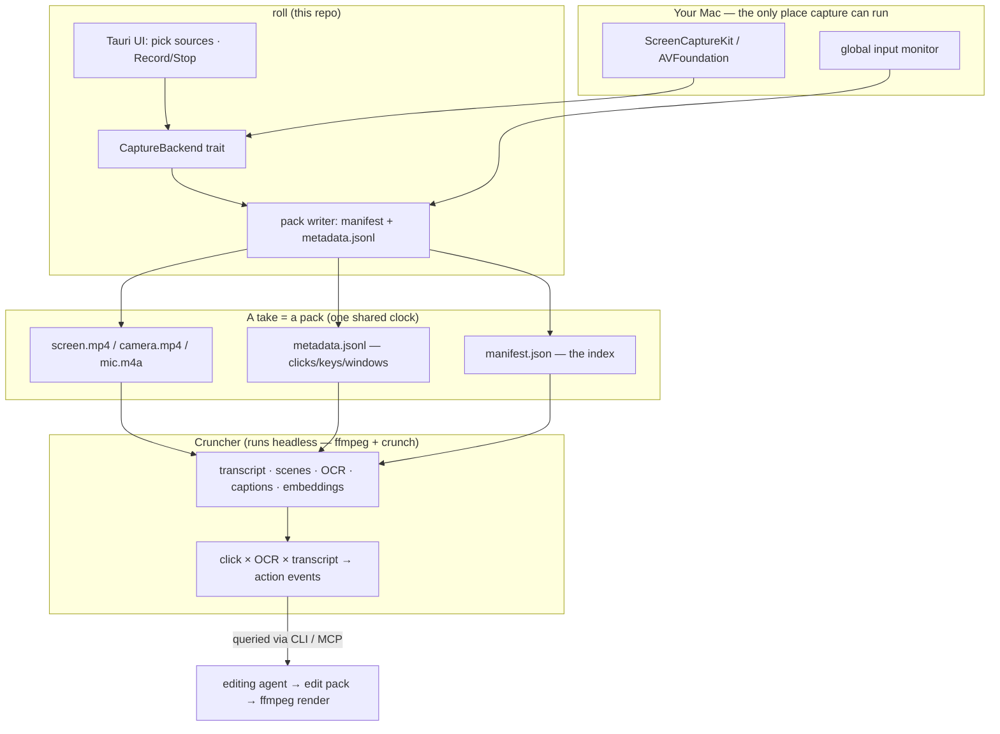

# roll

**Record once. Hand the agent a queryable pack.**

`roll` is a screen + camera + mic recorder that captures **input telemetry**
— clicks, keystrokes, window focus — on the *same clock* as the video, then
processes a take into a deterministic, **agent-queryable pack**. An LLM doesn't
watch the footage; it *queries the pack* and decides the edit.

It's the capture front-end for [edator](https://github.com/StuMason/edator):
`roll` makes the recording, edator makes the cut.

> **Status: early.** The desktop shell, the pack contract, the mock capture
> backend, and the universal CI build all work today. The real macOS capture
> engine and the cruncher are deliberately *not* built yet — see
> [What works today](#what-works-today).

## Why

Every screen recorder throws away the most useful thing in the room: **what you
actually did.** The cursor coordinates, the click on the *Deploy* button, the
window you switched to — all discarded the moment it renders to pixels. An
editing agent then has to *infer* those events back out of the video, expensively.

`roll` keeps them. A take isn't a video file, it's a **pack**: the rolls, plus a
timeline of input events, plus an index — so the click at `t=63.2s` can be
joined to the on-screen text under the cursor *and* the words being spoken at
that instant. That join — `click × OCR × transcript` — is the thing no recorder
currently hands to an agent.

## Architecture



The hard boundary is the **pack** (see [`schemas/pack.schema.json`](schemas/pack.schema.json)).
Everything upstream is capture; everything downstream is an agent querying facts.
Get the boundary right and each half evolves independently.

## What works today

| Piece | State |
| --- | --- |
| Tauri desktop shell (source picker, record/stop, live timer) | ✅ runs |
| `CaptureBackend` trait + **mock** backend (real `metadata.jsonl`, placeholder media) | ✅ runs everywhere, incl. headless Linux |
| Pack contract — typed Rust + JSON Schema | ✅ |
| Universal macOS (Intel + Apple Silicon) + Win + Linux CI build | ✅ `tauri-action` |
| **Real macOS capture** (ScreenCaptureKit/AVFoundation + input monitor) | ⛔ stub — gated on the pack/join proof |
| **Cruncher** (ffmpeg + crunch → pack + action-event join) | ⛔ next, once a real recording exists |

The mock backend is deliberate: it lets the *entire* record → pack loop be
built and run on a headless box, with the one platform-specific piece — the Mac
capture engine — slotting in behind the trait later, without touching anything
else. See [`src-tauri/src/capture/`](src-tauri/src/capture/).

## Develop

```bash
npm install
npm run tauri dev      # runs the shell with the mock backend
```

On this stack the **shell builds and runs anywhere**; only the real capture
engine needs macOS. Build artifacts come from CI on real runners.

```bash
npm run build                         # frontend
cargo test  --manifest-path src-tauri/Cargo.toml
cargo build --manifest-path src-tauri/Cargo.toml
```

## License

MIT © Stuart Mason
