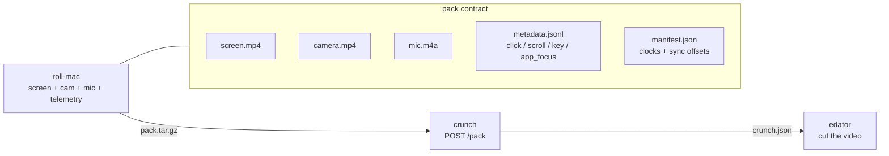
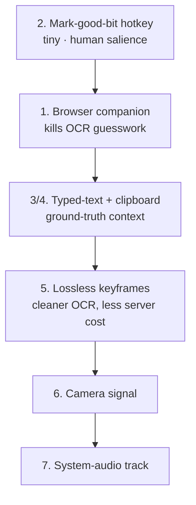

# Feeding Crunch — capture-side roadmap

> What `roll` could capture to make `crunch` (and therefore `edator`) dramatically better.
> Notes-to-self / backlog, not a spec. Ranked by leverage for the way Stu actually records.

## ✅ Shipped in roll (2026-07-01)

The capture-side truths that only the recorder can get are **done** and in the pack contract (`schemas/pack.schema.json`):

- **#2 marker** — dropped. A keyboard chord to remember is worse than just *saying* "that was a good bit" out loud; crunch already turns spoken cues into moments, so the transcript is the marker.
- **#3 typed-text** — printable keystrokes accumulate into `{type:"text", t_ms, end_ms, text, app, window}`, flushed on Enter/Tab/focus-change. **Never captured while macOS secure input is active.** (Plain keys no longer spam `key` events; `key` now = shortcuts/special keys only.)
- **#4 clipboard** — `{type:"clipboard", t_ms, chars, text}` (capped 2000, skips concealed/secure payloads).
- **#5 keyframes** — pristine full-res PNGs in `keyframes/<t_ms>.png`, snapshotted on click / app-switch. **OCR these directly — no H.264 re-decode, no motion blur.**
- **#7 system-audio** — separate `sysaudio.m4a` track (SCK, same clock; `manifest.sysaudio` + `sysAudioSyncOffsetMs`). Mic stays clean for prosody.

**Not in roll — this is crunch's job:** #6 camera face/pose signal. Perception over already-captured video belongs in crunch's planned MediaPipe camera track (#16), not the recorder. roll ships raw `camera.mp4`; crunch analyses it. (A capture-time `mouth_open` proxy was tried and pulled — brittle inferred signal, wrong layer.)

**Next project:** #1 browser companion (its own component — extension + bridge + clock-sync).

---

## The pipeline

`crunch` joins `event × on-screen-text × words-said` on a shared clock and now also emits
**scored moments** (vocal emphasis, pauses, spoken cues) and **segments** (a beat-by-beat outline).
Everything below is about giving it *better raw material* so it guesses less.

## The core insight that drives the ranking

For **browser / Electron** content (Arc, Claude, VS Code-web, etc. — i.e. most of what Stu records),
**macOS accessibility is hollow**: a click inside a web page returns `AXScrollArea / label = None`, not
the button text. So `crunch`'s only screen signal there is **OCR**, which has an irreducible per-frame
error floor (it reads "x402" as "x42" on bad frames, misreads small/styled text). We can polish OCR, but
the real fix is to **stop guessing and capture the truth at the source** for the common case.

## Ranked opportunities

### 1. Browser companion (extension) — biggest win for Stu's workflow
A tiny extension that emits, per interaction: `{ url, page_title, clicked_element_text, clicked_element_role,
visible_headings, scroll_position }` — and optionally the visible text of the viewport.

- **Why:** makes `crunch`'s screen + click layer **authoritative** for browser work, eliminating OCR
  guesswork exactly where it's weakest. The NotRobophobic button that OCR'd as "DS" would just *be*
  "Add to basket" / its real label + URL.
- **crunch use:** `events[].on_screen_text` and `ocr_at_click` become ground-truth; `segments` titles get
  real page URLs instead of OCR'd window chrome.
- **Effort:** medium (extension + a localhost bridge to the roll recorder, or write to the pack post-hoc).
- **Privacy:** local-only; gate or redact obvious secret fields.

### 2. "Mark the good bit" hotkey — cheapest high-value thing on this list
A global hotkey during recording that drops a `marker` event into `metadata.jsonl` (optionally with a
tier: 👍 / ⭐ / "redo that").

- **Why:** the creator knows what matters *in the moment*. This is the single highest-quality editorial
  signal that exists, and it's basically free to add.
- **crunch use:** a `moment` with `source: "human"`, `score: 1.0` — outranks every inferred signal, and a
  strong segment boundary / highlight seed.
- **Effort:** tiny.

### 3. Typed-text capture (non-secret fields)
`roll` already logs key events; capture the resulting **text** of what was typed (search queries, prompts,
commands), excluding password/secure fields.

- **Why:** "what did he search / what prompt did he write" is huge context an editor wants, and OCR of a
  typing field mid-keystroke is unreliable.
- **crunch use:** richer `events`, better segment keywords/summaries.
- **Privacy:** **must** respect secure-input mode; allowlist or redact.

### 4. Clipboard capture
Log copy/paste payloads (size-capped, secure-input-aware).

- **Why:** the copied thing is very often *the thing being demoed* (a URL, a snippet, an address).
- **Effort:** small. **Privacy:** same gating as typed text.

### 5. Lossless keyframe snapshots
On every click / app-switch (and every N seconds), write a **PNG** snapshot alongside `screen.mp4`.

- **Why:** `crunch` currently re-decodes frames from H.264 `screen.mp4`; P-frames during scroll are
  motion-blurred and OCR-hostile. Pristine PNGs at the moments that matter = cleaner OCR + no ffmpeg
  decode cost on the server.
- **crunch use:** OCR those directly; skip frame extraction.
- **Effort:** small-medium; trade-off is pack size.

### 6. Camera signal (when the cam is kept)
A lightweight per-second `camera.jsonl`: `{ face_present, face_box, speaking_estimate, motion }` — or just
let `crunch` run a CPU face detector. Even a boolean "on camera / talking" is valuable.

- **Why:** tells the editor when a webcam-PiP cutaway is *available* and when you reacted — the "cut to the
  cam here" signal.
- **crunch use:** `camera` spans + camera-driven `moments`.
- **Effort:** medium (face detection). Could live in `roll` (capture-time) or `crunch` (a camera sidecar).

### 7. Separate system-audio track
Record system/app audio on its own track (not mixed into the mic).

- **Why:** lets `crunch` detect "a video/notification played here" and keeps the mic clean for prosody
  (emphasis/pause detection is more accurate without system audio bleeding in).
- **Effort:** medium (macOS audio tap).

## Suggested order

Start with **#2** (trivial, immediate value) and **#1** (the structural fix for browser work). Everything
else is incremental polish on already-good signal.

## What crunch already does with the current pack (for reference)

- `transcript` — Whisper large-v3-turbo, ≈AssemblyAI quality, word-timed.
- `screen` — line-level OCR spans (PNG frames, ~95% clean), fuzzy-deduped.
- `events` — clicks/scrolls/keys with app/window/ax + `ocr_at_click`.
- `moments` — scored, source-tagged: `telemetry` (app switch / click), `transcript` (spoken cues),
  `audio` (vocal emphasis + pauses).
- `segments` — beat-by-beat outline (boundaries from app switches + long pauses; extractive title /
  keywords / summary).

The gaps above are precisely the inputs that would let `crunch` stop *inferring* and start *knowing*.
